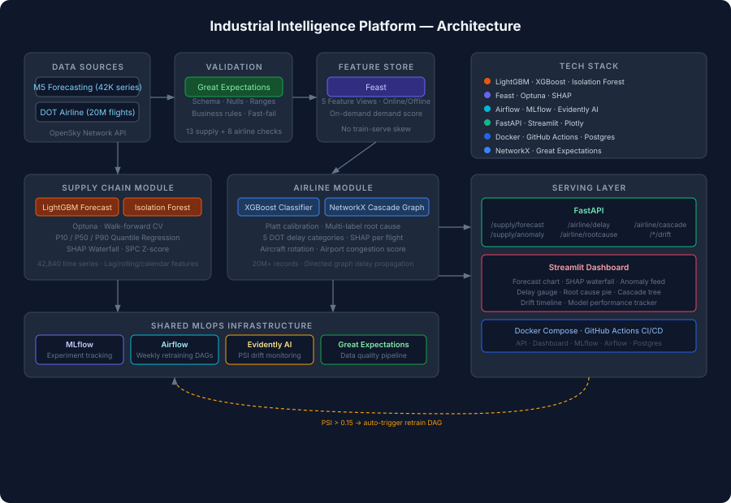

# 🏭 Industrial Intelligence Platform

**Supply Chain Forecasting + Airline Operations Intelligence**
Production-grade ML system across two domains with shared MLOps infrastructure.



---

## Quick Start

```bash
git clone https://github.com/YOUR_USERNAME/industrial-intelligence-platform
cd industrial-intelligence-platform
python -m venv .venv && source .venv/bin/activate
pip install -r requirements.txt

# Download data (needs Kaggle API key in .env)
cp .env.example .env          # add your KAGGLE_USERNAME + KAGGLE_KEY
python data/supply_chain/download.py
python data/airline/download.py

# Validate + featurize
python feature_store/materialize.py --sample

# Train (sample mode ~5 min | full mode ~60 min)
python -m modules.supply_chain.models.train --sample --trials 10
python -m modules.airline.models.train --sample 0.05 --trials 10

# Launch full stack
docker-compose up
```

| Service | URL |
|---|---|
| API + Docs | http://localhost:8000/docs |
| Dashboard  | http://localhost:8501 |
| MLflow UI  | http://localhost:5000 |
| Airflow UI | http://localhost:8080 (admin/admin) |

---
## Repository Structure

```text
.
├── data/
│   ├── supply_chain/               # M5 Forecasting dataset (42,840 time series)
│   └── airline/                    # DOT On-Time Performance (20M+ records)
├── modules/
│   ├── supply_chain/
│   │   ├── features/               # Lag, rolling, calendar, and price transformations
│   │   ├── models/                 # LightGBM quantile regression (P10 / P50 / P90)
│   │   └── anomaly/                # Isolation Forest & SPC Z-score outlier detection
│   └── airline/
│       ├── features/               # Tail rotation, airport congestion, & weather encodings
│       ├── models/                 # XGBoost delay classification & duration regression
│       └── cascade/                # NetworkX delay propagation graph models
├── feature_store/
│   ├── feature_repo/               # Feast entity & feature view definitions (5 views)
│   ├── materialize.py              # Validation, engineering, and ingestion pipeline
│   └── retrieve.py                 # Low-latency online & point-in-time offline feature retrieval
├── great_expectations/
│   └── expectations/               # Data quality suites: M5 (13 checks) & Airline (8 checks)
├── mlops/
│   ├── airflow/dags/               # Orchestration: supply_chain, airline, drift_monitor
│   ├── evidently/                  # PSI data drift monitoring & alerting hooks
│   └── mlflow/                     # Experiment tracking & model registry artifacts
├── api/
│   ├── main.py                     # FastAPI entry point & lifespan handler
│   └── routers/                    # Domain endpoints: supply_chain.py & airline.py
├── dashboard/
│   └── app.py                      # Interactive Streamlit operations dashboard (dual-tab)
├── tests/
│   └── test_api.py                 # Comprehensive endpoint & integration test suite
├── docs/
│   └── architecture.svg            # End-to-end dataflow & component architecture diagram
├── .github/
│   └── workflows/
│       └── ci.yml                  # Automated CI: linting, pytest, and Docker builds
├── docker-compose.yml              # Local orchestration: API, Dashboard, MLflow, Airflow, Postgres
├── Dockerfile.api                  # Production image for FastAPI inference service
└── Dockerfile.dashboard            # Production image for Streamlit monitoring UI
## Tech Stack

| Category | Tools |
|---|---|
| ML — Supply Chain | LightGBM, Isolation Forest, Optuna, SHAP |
| ML — Airline | XGBoost, Platt calibration, NetworkX, MultiOutputClassifier |
| Feature Store | Feast (5 feature views, online + offline) |
| Data Validation | Great Expectations (21 checks across both modules) |
| Experiment Tracking | MLflow (params, metrics, model registry) |
| Drift Monitoring | Evidently AI (PSI per feature, auto-retrain trigger) |
| Orchestration | Apache Airflow (3 DAGs — supply, airline, drift) |
| API | FastAPI (8 endpoints, demo mode without trained models) |
| Dashboard | Streamlit + Plotly (gauge, SHAP waterfall, cascade tree, drift timeline) |
| Containerization | Docker Compose (5 services) |
| CI/CD | GitHub Actions (lint → test → build) |

---

## API Reference

### Supply Chain
```bash
POST /supply/forecast    # P10/P50/P90 demand forecast + SHAP explanation
POST /supply/anomaly     # Isolation Forest + SPC z-score anomaly detection
GET  /supply/drift       # Live PSI drift score from latest Evidently report
GET  /supply/model-info  # Feature list, model metadata
```

### Airline
```bash
POST /airline/delay      # Delay probability (calibrated) + expected minutes + SHAP
POST /airline/rootcause  # Carrier / Weather / NAS-ATC / Security / Late Aircraft breakdown
POST /airline/cascade    # NetworkX graph: propagate delay to downstream flights
GET  /airline/drift      # Live drift score
GET  /airline/model-info # Model metadata
```

> All endpoints work in **demo mode** before models are trained — returns realistic mock data.

---

## MLOps Pipeline

```
Weekly (Monday 2am):
  Data ingestion → Great Expectations validation → Feature engineering
  → Feast materialization → [drift check] → retrain if PSI > 0.15

Weekly (Monday 4am):
  Evidently AI drift check (both modules in parallel)
  → auto-trigger supply_chain_pipeline or airline_pipeline DAG
  → MLflow logs new run → model promoted in registry
```

**Running drift check manually:**
```bash
python -m mlops.evidently.drift_monitor --module both
# Saves JSON report to mlops/evidently/reports/
# /supply/drift and /airline/drift endpoints pick this up automatically
```

---

## Key Design Decisions

**Quantile regression (P10/P50/P90)** — Point forecasts are not enough for inventory decisions. Safety stock optimization needs a range.

**Platt scaling calibration** — Raw XGBoost scores are not probabilities. Platt scaling fits a sigmoid on validation data → reliable probability outputs for risk classification.

**Feast feature store** — Eliminates train-serve skew. Same feature computation offline (training) and online (inference). Critical for production ML.

**NetworkX cascade graph** — Airline delays are a directed graph problem. Flight connections are edges; delays inherit with buffer subtraction. Standard classifiers can't model this propagation structure.

**Great Expectations before training** — Silent data quality issues cause silent model degradation. GE hard-fails the Airflow pipeline before anything reaches the model.

**Evidently AI PSI monitoring** — PSI (Population Stability Index) tracks distribution shift per feature. Auto-triggers retraining when PSI > 0.15, keeping models fresh without manual intervention.

---

## Build Progress

| Week | Milestone | Status |
|---|---|---|
| 1 | Repo, Docker, CI/CD, supply chain FastAPI + Streamlit | ✅ |
| 2 | Great Expectations, Feast feature store, Airflow DAG skeleton | ✅ |
| 3–4 | LightGBM + Optuna + walk-forward CV + anomaly detection + SHAP | ✅ |
| 5–6 | XGBoost delay model + Platt calibration + root cause + NetworkX cascade | ✅ |
| 7 | Evidently AI drift monitoring + Airflow auto-retrain DAGs | ✅ |
| 8 | Architecture diagram, full docker-compose, README polish | ✅ |

---

## Dataset Sources
- [M5 Forecasting — Walmart](https://www.kaggle.com/c/m5-forecasting-accuracy)
- [DOT Airline On-Time Performance](https://www.kaggle.com/datasets/yuanyuwendymu/airline-delay-and-cancellation-data-2009-2018)
- [OpenSky Network API](https://opensky-network.org/apidoc/rest.html)
